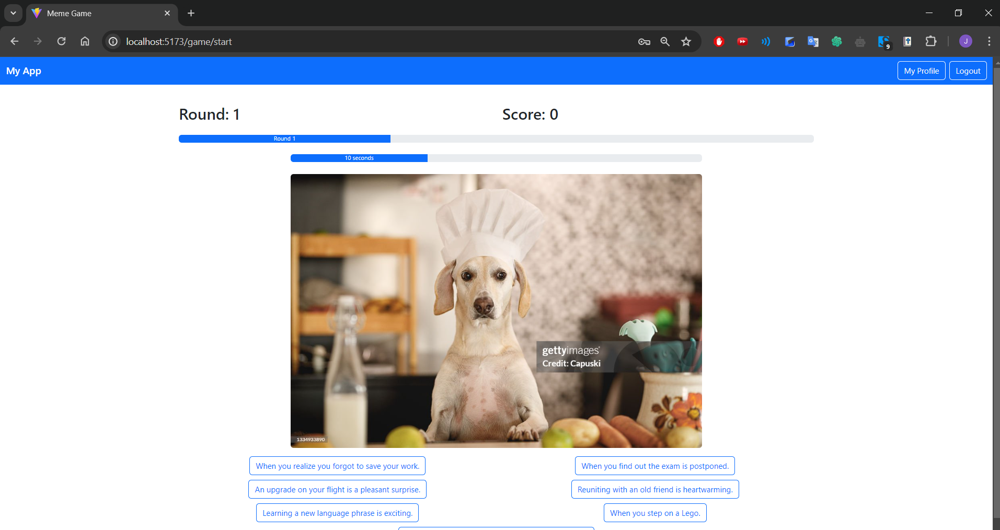
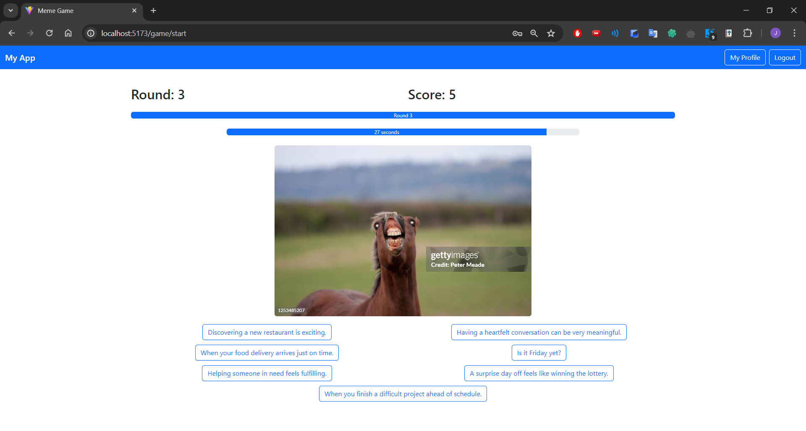

# Exam # 1: "Meme Game"
## Student: s321351 LEON ARDYLA, JAIME 

## React Client Application Routes

- Route `/`: Home page, serves as the main page from where users can navigate to other sections.
- Route `/meme`: Route for presenting a meme (image and possible captions). Serves as each round for a logged in user and as the full game for a non-logged one.
- Route `/game/start`: Route for starting a game as a logged in user. 
- Route `/game-summary/:gameId`: Route for displaying the game summary for a specific game identified by gameId.
- Route `/profile`: Route for displaying the game history of a logged in user.
- Route `/login`: Route for displaying the login form, which allows users to authenticate and log into the application.
- Route `*`: Catch-all for other routes. Displays a 404 - Page Not Found.

## Main React Components

- `HomePage` (in `Homepage.jsx`): Represents the home page of the application. Displays a welcome message for logged in users and a button to start a game.
- `LoginForm` (in `LoginComponent.jsx`): Provides a form for user login functionality. Allows users to enter their email and password, validates input, and triggers a login action when submitted
- `LogoutButton` (in `LogoutComponent.jsx`): Renders a button for user logout functionality.
- `NavHeader` (in `NavHeader.jsx`): Renders the navigation header for the application. Includes buttons for navigating to user's profile and log in or log out buttons.
- `Meme` (in `Meme.jsx`): Facilitates the gameplay functionality by fetching memes and handling user interaction like selecting captions and managing game rounds.
- `Caption` (in `Caption.jsx`): Manages the display of the possible captions for a meme.
- `Result` (in `Result.jsx`): Displays the output of a game round, indicating wheter the selected captions were correct or not.
- `Game` (in `Game.jsx`): Manages the gameplay logic for a logged in user, including rounds and scoring, interacting with the `Meme`component.
- `Timer` (in `Timer.jsx`): Manages a countdown timer for the Meme Game, displaying remaining time with a progress bar and triggering an action on timeout.
- `GameSummary` (in `GameSummary.jsx`): Displays the summary of a game, including total score and details of the correct rounds played.
- `GameHistory` (in `GameHistory.jsx`): Displays the game history for a user, including details of each game played and their respective rounds.
- `App` (in `App.jsx): Main component managing application routing, authentication state, and displaying different pages based on the route.

## API Server

- POST `/api/sessions`: Log in a user with credentials
  - request parameters and request body content: 
    - `username`: `string` 
    - `password`: `string`
  - response body content: 
    - User object:
      - `id`: `integer`
      - `username`: `string`
      - `name`: `string`
  - response status codes and possible errors:
    - `201`: Successful login
    - `401`: Wrong credentials

- GET `/api/sessions/current`: Get the current authenticated user's info
  - request parameters:
    - None
  - response body content:
    - User object:
      - `id`: `integer`
      - `username`: `string`
      - `name`: `string`
  - response status codes and possible errors:
    - `200`: Succesfully retrieved user information
    - `401`: Not authenticated

- DELETE `/api/sessions/current`: Log out the current user
  - request parameters:
    - None
  - response body content:
    - None
  - response status codes and possible errors:
    - `200`: Successfull log out

- POST `/api/meme`: Get a meme object (a non-used random image and 7 captions in random order, two of them associated with the image)
  - request parameters:
    - `usedImagesIds`: [`array of integers`]
  - response body content:
    - Image object:
      - `imageId`: `integer`
      - `image_url`: `string`
    - Array of caption object:
      - `captionId`: `integer`
      - `text`: `string`
  - response status codes and possible errors:
    - `200`: Successfully retrieved meme
    - `500`: Error fetching meme

- POST `/api/meme/verify`: Verify a selected caption for a meme
  - request parameters:
    - `imageId`: `integer`
    - `captionId`: `integer`
  - response body content:
    - `isCorrect`: `boolean`
  - response status codes and possible errors:
    - `200`: Successfully verified caption
    - `500`: Error verifying caption

- POST `/api/meme/correct-captions`: Get correct captions for an image
  - request parameters:
    - `imageId`: `integer`
  - response body content:
    - Array of caption object:
      - `captionId`: `integer`
      - `text`: `string`
  - response status codes and possible errors:
    - `200`: Successfully retrieved correct captions
    - `500`: Error getting correct captions

- POST `/api/complete-game`: Get correct captions for an image
  - request parameters:
    - `userId`: `integer`
    - `score`: `integer`
    - Array of round objects: 
      - `meme_id`: `integer`
      - `selected_caption`: `integer`
      - `correct`: `boolean`
  - response body content:
    - `gameId`: `integer`
  - response status codes and possible errors:
    - `200`: Successfully completed game
    - `500`: Impossible to complete game

- GET `/api/games/:gameId/summary`: Get the summary of a completed game
  - request parameters:
    - Path parameter: `gameId`
  - response body content:
    - `totalScore`: `integer`
    - Array of round objects: 
      - `imageUrl`: `string`
      - `selected_caption`: `string`
      - `score`: `integer`
  - response status codes and possible errors:
    - `200`: Successfully retrieved game summary
    - `500`: Error fetching game summary

- GET `/api/:userId/history`: Get the game history of a user
  - request parameters:
    - Path parameter: `userId`
  - response body content:
    - `totalScore`: `integer`
    - Array of game objects: 
      - `totalScore`: `integer`
      - Array of round objects:
        - `imageUrl`: `string`
        - `selected_caption`: `string`
        - `score`: `integer` 

  - response status codes and possible errors:
    - `200`: Successfully retrieved game history
    - `500`: Error fetching game history

## Database Tables

- Table `user` - Stores user information
  - Columns: `id`, `name`, `email`, `password`, `salt`
- Table `image` - Stores images data
  - Columns: `id`, `image_url`
- Table `caption` - Stores captions data
  - Columns: `id`, `text`
- Table `meme` - Stores the relationship between captions and images
  - Columns: `id`, `image_id`, `caption_id`
- Table `round` - Stores individual rounds information for loggedin users
  - Columns: `id`, `game_id`, `image_id`, `selected_caption_id`, `score`	
- Table `game` - Stores full game information for loggedin users
  - Columns: `id`, `user_id`, `score`	

## Screenshots

## Users Credentials

- username: jaime.leon@polito.it, password: testtest
- username: luigi.derussis@polito.it, password: testtest
